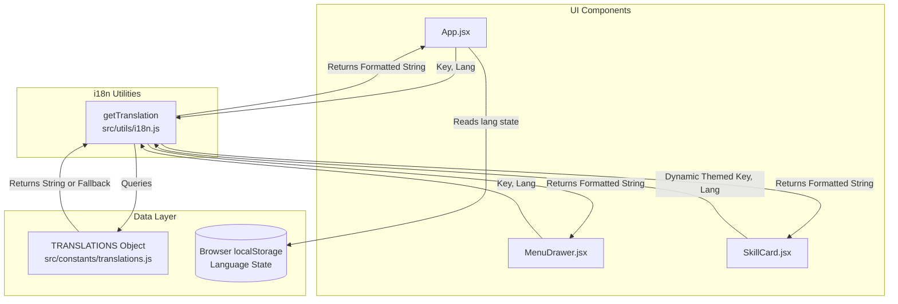
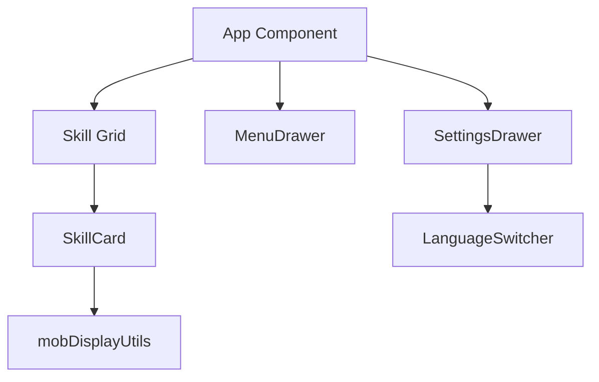

# System Architecture & Call Graphs

This document highlights the architecture of the application, focusing specifically on the data flow and how components interact with the newly decoupled Translation logic.

## 1. Translation System Call Graph
The following Mermaid diagram illustrates how a component (like `App.jsx` or `SkillCard.jsx`) retrieves text. It shows the decoupling of logic and IO/Configuration.

## 2. Component Hierarchy (Refactored scope)
By abstracting the translations, the UI components no longer contain heavy textual data, making the React tree much lighter.

## 3. Separation of Concerns (Logic vs I/O)
- **Logic**: Component behavior, React State, Drag-and-drop mechanics.
- **I/O & Data**: Saved persistently in `localStorage`, and raw configurations map to `gameData.jsx` and `translations.js`.
- By removing hardcoded English/French text from components, we effectively decoupled presentation logic from raw static data output.