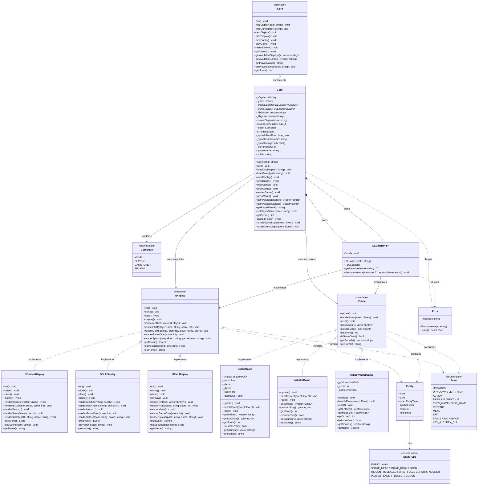
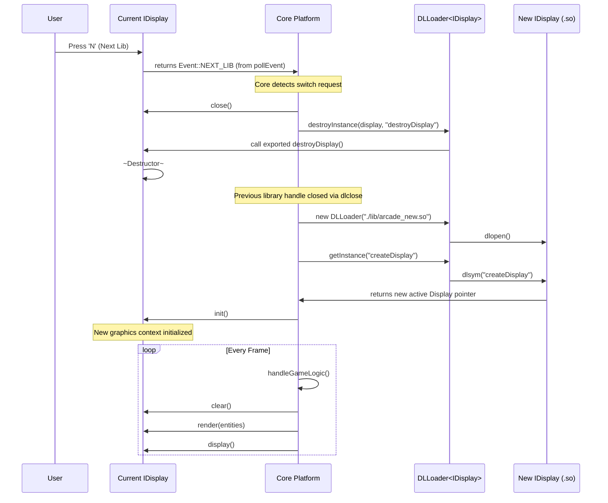

# Arcade — Class Diagram & Architecture Manual

> **Version:** 1.0 — April 2026

---

## 1. Class Diagram



---

## 3. Sequence: Runtime Library Switching

The following diagram illustrates the sequence of events when a user triggers a "Next Graphics Library" event during gameplay.



---

## 4. Architecture Manual

### 2.1 How the System Starts

```
main(argc, argv)
  │
  ├── validate argument count (must be 1 path)
  ├── new Core(argv[1])          ← pass initial display .so path
  │     ├── scanLibFolder()      ← scan ./lib/, classify .so files
  │     └── loadDisplay(argv[1]) ← load the initial graphics library
  └── core.run()                 ← enter the main event loop
```

`main.cpp` also validates that the library passed as argument is a valid display library (by probing for the `createDisplay` symbol). If it finds `createGame` instead, it prints an error and exits with code 84.

---

### 2.2 Library Scanning (`scanLibFolder`)

On startup, `Core::scanLibFolder()` opens the `./lib/` directory with POSIX `opendir`/`readdir`. For every `.so` file:

1. `dlopen(path, RTLD_LAZY)` — load the library tentatively.
2. `dlsym(handle, "createDisplay")` — found? → add to `_libdisplay`.
3. `dlsym(handle, "createGame")` — found? → add to `_libgame`.
4. `dlclose(handle)` — immediately release; actual use comes later.

Both lists are sorted alphabetically for consistent indexing across runs.

---

### 2.3 The Main Loop

The core runs at a fixed **60 FPS** target (`frameDuration = 1,000,000 µs / 60`). Each iteration:

```
while (isRunning):
  ┌─ display->clear()         ← wipe previous frame
  ├─ event = display->pollEvent()
  │
  ├─ Handle global events (EXIT, NEXT_LIB, PREV_LIB, NEXT_GAME, PREV_GAME, MENU, RESTART)
  │
  └─ Dispatch by CoreState:
       MENU      → handleMenuLogic(event)
       PLAYING   → handleGameLogic(event)
       GAME_OVER → display->renderGameOver(score)
       SPLASH    → display->renderSplash(...)  [2 sec timeout → PLAYING]
  
  display->display()          ← flush frame
  sleep(remaining_time)       ← cap to 60 FPS
```

---

### 2.4 State Machine

```
          ┌────────────────────────────────────────┐
          │               MENU                     │
          │  renderMenu() called every frame       │
          └────────────────┬───────────────────────┘
                           │ ACTION (game selected)
                           ▼
          ┌────────────────────────────────────────┐
          │               SPLASH                   │
          │  renderSplash() called for 2 seconds   │
          └────────────────┬───────────────────────┘
                           │ 2s elapsed
                           ▼
          ┌────────────────────────────────────────┐
          │              PLAYING                   │◄──── RESTART
          │  handleGameLogic() each frame          │
          └────────────────┬───────────────────────┘
                           │ isGameOver() == true
                           ▼
          ┌────────────────────────────────────────┐
          │             GAME_OVER                  │
          │  renderGameOver() called every frame   │
          └────────────────┬───────────────────────┘
                           │ ACTION or MENU
                           ▼
                         MENU

   From any state:
     NEXT_LIB / PREV_LIB → switch display library (state preserved)
     NEXT_GAME / PREV_GAME → load new game → SPLASH (if PLAYING)
     MENU → transition directly to MENU
     EXIT → isRunning = false → exit loop
```

---

### 2.5 `DLLoader<T>` — Generic Dynamic Loader

`DLLoader<T>` is a RAII template class encapsulating the `libdl` API:

| Method | `libdl` call | Purpose |
|--------|-------------|---------|
| `DLLoader(path)` | `dlopen` | Open the `.so`, acquire handle |
| `~DLLoader()` | `dlclose` | Release the handle |
| `getInstance(symbol)` | `dlsym` | Get a factory function pointer, call it, return object |
| `destroyInstance(obj, symbol)` | `dlsym` | Get the destructor function pointer, call it |

Errors from `dlerror()` are wrapped into the `Error` exception class and propagated up to `main()`.

---

### 2.6 Display Switching

When the player presses NEXT_LIB / PREV_LIB:

1. `Core::nextDisplay()` / `prevDisplay()` increments/decrements `currentDisplayIndex`.
2. `Core::loadDisplay(path)` is called:
   - `display->close()` on the old library.
   - Old `DLLoader<IDisplay>` destroyed → `dlclose` called.
   - New `DLLoader<IDisplay>` created → `dlopen` on the new `.so`.
   - New `IDisplay*` created via `createDisplay()`.
3. `display->init()` called on the new library.
4. Game state is **preserved** — switching display does not affect the running game.

---

### 2.7 Game Switching

When the player presses NEXT_GAME / PREV_GAME (or selects from menu):

1. Old `DLLoader<IGame>` destroyed → `destroyGame()` and `dlclose` called.
2. New `DLLoader<IGame>` created → new `IGame*` created via `createGame()`.
3. `game->reset()` called to initialize state.
4. `_state` → `CoreState::SPLASH` → 2-second splash screen.
5. `_state` → `CoreState::PLAYING`.

---

### 2.8 Score Management

- Score is **read from the game** via `_game->getScore()` every frame and forwarded to `display->renderHUD()`.
- When `isGameOver()` returns `true`, the final score is **cached** in `Core::_currentscore`.
- This cached value is used for `renderGameOver()` and persisted through game reloads.
- The score is currently **not persisted to disk** (no file I/O in the current implementation).

---

### 2.9 Sound Pipeline

```
IGame::getSounds()         → returns vector<string> of sound file paths
Core::handleGameLogic()    → iterates the vector
IDisplay::playSound(path)  → plays the sound (or no-ops if unsupported)
```

Sound paths are relative to the working directory. Games return them; displays play them. This keeps audio platform-neutral.

---

### 2.10 Error Handling

All critical errors use the `Error` class (extending `std::exception`):

```cpp
class Error : public std::exception {
    std::string _message;
public:
    Error(const std::string& message);
    const char* what() const noexcept override;
};
```

Errors from `dlopen`/`dlsym`, missing `./lib/` folder, and missing display libraries propagate to `main()`, are printed to **stderr**, and the program exits with code **84**.

---

*This document reflects the architecture as implemented in April 2026. Extend carefully: the interface contract between the core and plugins is stable and must not be broken to preserve cross-group compatibility.*
